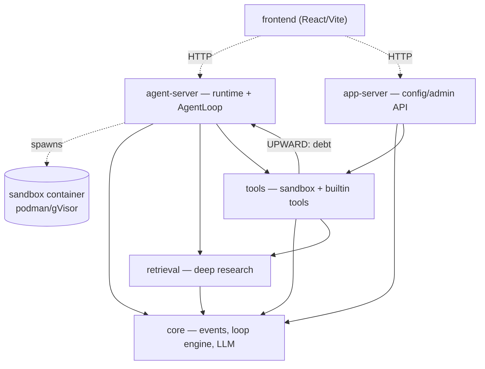

<!-- GENERATED by scripts/gen_arch_diagram.py — DO NOT EDIT. Re-run to refresh; the graph is derived from the code's imports. -->

# Architecture — container & package dependency map

Solid arrows = Python import dependencies (auto-derived). Dotted = runtime
(HTTP / sandbox spawn). A thick `UPWARD` arrow marks a tracked layering
violation (see `.importlinter`). Layering + size are enforced by
`lint-imports` and `scripts/check_arch_budget.py`.

